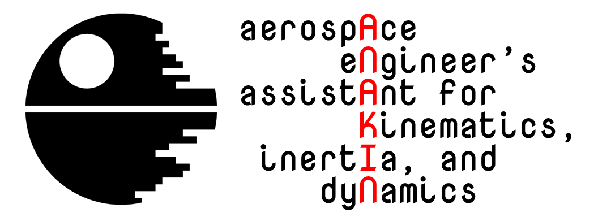

# Anakin

**Anakin** (Aerospace eNgineer's Assistant for Kinematics, Inertia and dyNamics)
is a Matlab framework that defines a number of classes to facilitate modeling and
solving Classical Mechanics problems in Aerospace Engineering and other disciplines.



## Installation

Installation requires simply that you
[download Anakin](https://github.com/mariomerinomartinez/anakin/archive/master.zip)
and add the base directory to your Matlab path.

### Dependencies

A recent version of Matlab is needed to run the code. The
[Symbolic Math Toolbox](https://www.mathworks.com/products/symbolic.html) is
required to use most of the functionality.
Anakin has been developed in Matlab R2016b Academic version. However, R2018a or
later is recommended as it includes the live script functionality (optional).

## Quick usage guide

Anakin full documentation can be found in ??.

It is recommended that you first import the Anakin package with

```Matlab
import anakin.*
```

If you do not, then you will need to access all classes with the `anakin.` prefix,
e.g.  `anakin.vector`.

Currently Anakin defines the following classes:

* `vector`: vectors
* `basis`: creation of vector bases
* `frame`: creation of reference frames

The description of the properties and methods of each class is included in the
header comments of each code file.

### Testing

Unit tests are found in the `/test` subdirectory. After adding the Anakin package
to your Matlab path, you can run all tests by executing `runtests` from this
subdirectory.

## Contributing

If you have any comments for improvement or
are interested in contributing to the continued
development of this or any of my other codes, you can contact me through
[Mario's website](http://mariomerino.uc3m.es/).

## Acknowledging

This program is the result of substantial effort. It is released as open
source in the hope that it will be useful to other people. If you find it
useful and/or use it in any of your works, I kindly ask you to acknowledge it
by citing ??

## License

Copyright (c) 2018 Mario Merino.
The software is released as open source with the [MIT License](LICENSE.md).
